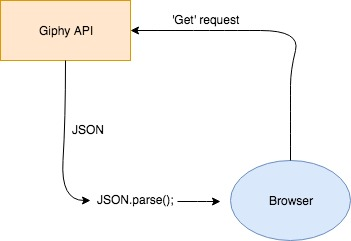

# Week 1 - Hello API 🐒

LIVE DEMO: https://koenblezer.github.io/web-app-from-scratch-18-19/week1/index.html

# Doel van de app

Deze app is bedoelt om de gebruiker op een snelle manier originele gif-reacties te laten vinden.

# Actor diagram

# API keuze en beperkingen

Er wordt gebruik gemaakt van de Giphy API, Giphy is een van de grootste GIF-databases ter wereld. De development API-key heeft een rate limit van 42 zoek verzoeken per uur, 1000 zoek verzoeken per dag en 10 upload verzoeken per dag.

# Interactie-flow

Hoe flowed interactie door de applicatie? (interaction diagram)

# Design patterns en best practices

??

# Feature wishlist

- Populaire zoektermen tonen
-
